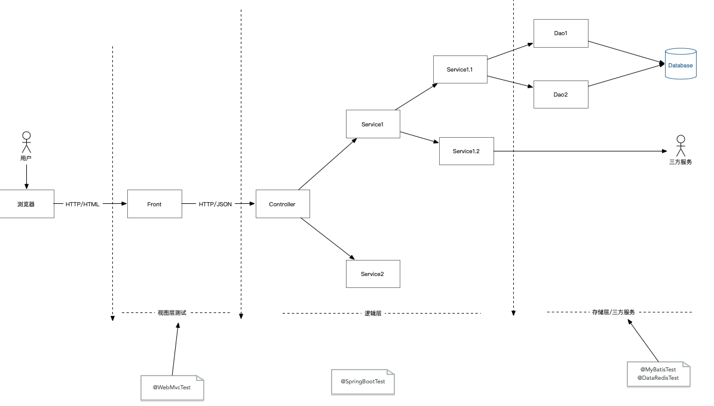

# Spring Boot 单元测试Demo

## 测试的场景

## 代码质量

1. 编码规范 阿里巴巴Java开发手册 & IDEA 插件
2. FindBugs 静态代码检查
3. [编译时错误检查](https://errorprone.info/docs/installation)
4. 单元测试

## 测试的内容

1. 逻辑层
2. 存储层
3. 视图层

## 测试用的工具

1. SpringBootTest
2. Mockito
3. AssertJ-*
4. Junit5

## 测试内容的校验

1. 覆盖率